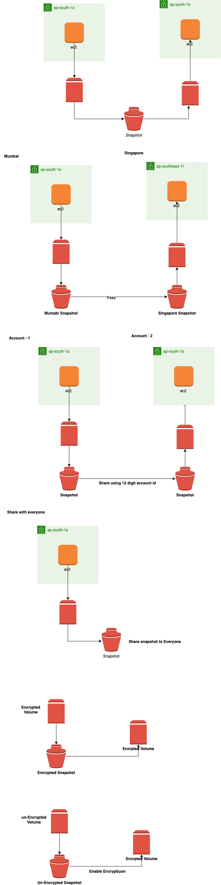

# EC2-Snapshot
Visual explanation of how to create, copy, and share AWS EC2 Snapshots across regions and accounts.

# 📦 EC2 Snapshot Sharing - AWS

This repository contains a visual representation of how to **create, copy, and share an Amazon EC2 snapshot** across **regions** and **AWS accounts**. These operations are essential for cross-region backups, disaster recovery, and multi-account architecture in AWS.

---

## 🗂️ What’s Included?

- ✅ Creation of snapshot from EC2 instance
- 🔄 Copying the snapshot to a different AWS region
- 🔗 Sharing the snapshot with another AWS account
- 🖼️ Visual diagram to make the concept easy to understand

---

## 📊 Architecture Diagram

---

## 💡 Use Cases

- **Disaster Recovery:** Easily restore instances from snapshots in different regions during outages.
- **Cross-Account Sharing:** Allow trusted accounts to launch instances from shared snapshots.
- **Migration Strategy:** Move workloads from one region/account to another securely.
- **Multi-Region AMIs:** Use snapshots as a base for launching EC2 instances in other regions.

---

## ⚙️ How It Works

1. **Create an EC2 instance and attach a volume.**
2. **Create a snapshot** of the attached volume.
3. **Copy the snapshot** to another region (e.g., from `ap-south-1a` to `ap-southeast-1`).
4. **Share the snapshot** with another AWS account by modifying permissions.
5. The target account or region can **create volumes or AMIs** from the shared snapshot.

---

## 📌 AWS Services Used

- Amazon EC2
- Amazon EBS Snapshots
- AWS Identity and Access Management (IAM)
- AWS Regions & Availability Zones

---

## 📷 Screenshots

Visual guide included in `ec2.png`.

---

## 🔗 Author

**Karunakar Jadi**  
[LinkedIn](https://www.linkedin.com/in/karunakarjadi123) | [GitHub](https://github.com/Karunakarjadi1609)

---

## 🏷️ Tags

`AWS` `EC2` `Snapshot` `DevOps` `CrossRegion` `Cloud` `Infrastructure` `CloudEngineer` `GitHubProjects`
